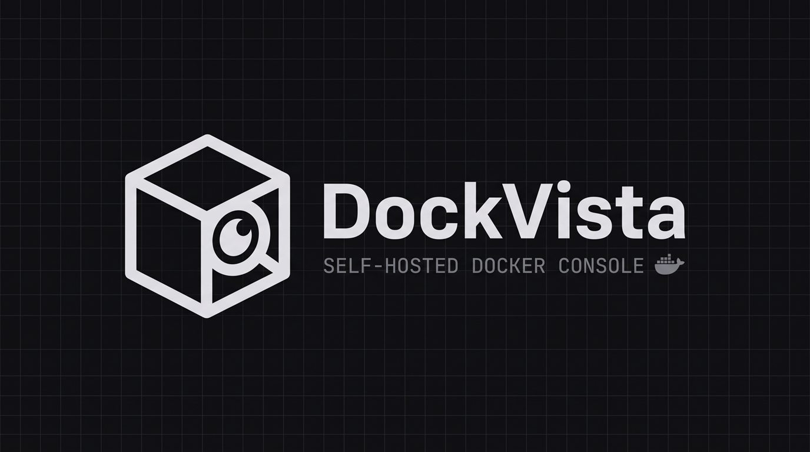
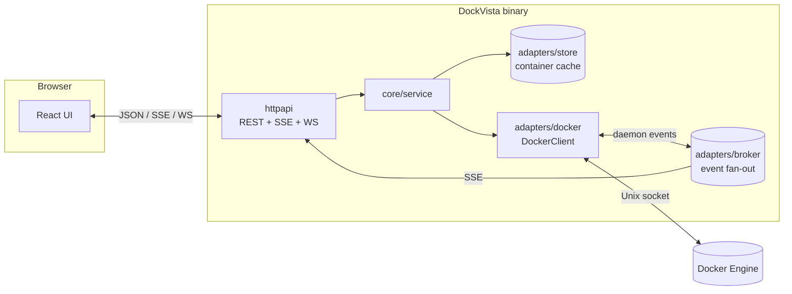

# DockVista

<p align="center">
  
</p>

[](https://github.com/faritreascodev/dockvista/actions/workflows/ci.yml)

[](LICENSE)

A self-contained Docker dashboard — Containers, Images, Volumes, Networks and
Compose-project grouping, a live terminal into any container, real-time
updates pushed from the Docker daemon's own event stream, and a
Portainer-style login wall — built with a clean-architecture Go backend and
a React/TypeScript frontend, shipped as a single binary.

## Features

- **Overview** — one screen for the whole engine: running/stopped counts,
  fleet CPU and memory with a live sparkline, `docker system df` disk usage
  (images, containers, volumes, build cache, and how much is reclaimable),
  top consumers, a live activity feed, and engine info.
- **Full container lifecycle** — create, start, stop, pause, restart, remove,
  live logs (SSE) with grep, timestamps, since-filters and download, an
  interactive terminal (WebSocket; `bash` when the image has it, `sh`
  otherwise), per-container CPU / memory / net / block I/O, a Files browser
  with a writable-layer Changes view (`docker diff`), Bind mounts spelled
  out (including Docker Desktop / WSL host paths), and a raw Inspect view.
- **Command palette** — `Ctrl/⌘ + K` fuzzy-jumps to any page or container;
  `Shift + Enter` opens a container straight on its logs.
- **Images, Volumes, Networks** — list, create/pull, remove, and prune, each
  with the same validation and confirmation-before-delete pattern. Image
  history shows layers. Volume browse lists files through a running mount.
- **Compose** — paste a `compose.yml` or clone an **https** git repo into a
  workspace DockVista owns, then `up`/`down` through the Docker API (no host
  homedir, no `build:`, no SSH remotes). Existing containers are still grouped
  by `com.docker.compose.project` with stack-wide start/stop.
- **Swarm** — nodes and services of the active engine. An engine that is not
  in Swarm mode says so; init/join/scale are not in this release.
- **Environments** — Local plus named TCP+TLS daemons. One environment is one
  engine; the sidebar switches the cookie. SSH is not in this release.
- **Read-only mode** — `DOCKVISTA_READ_ONLY=true` turns the instance into a
  safe status board: every state-changing route and the terminal answer
  `403` server-side, and the UI hides the controls.
- **Storage cleanup** — itemized disk usage (containers, images, volumes,
  build cache). Safe presets never touch running workloads. Anything labelled
  `dockvista.protect=true` is skipped. You type `DELETE` (or `DELETE VOLUMES`)
  before anything is removed, and the engine re-checks eligibility at that
  moment.
- **Real-time, not polling** — a background goroutine subscribes to the
  Docker daemon's own event stream and fans it out over SSE; the UI refetches
  within about a second of a real change (`docker stop` from another
  terminal, a health check flipping, etc.). A burst of events becomes one
  container-list call, not one call per event. Interval polling only exists
  as a safety net in case an event is missed.
- **Real CPU% / memory metrics** — computed with the same delta formula
  `docker stats` uses. One `GET /api/stats` call returns the whole fleet
  (fanned out with bounded concurrency server-side), and the UI pauses
  polling while the tab is hidden.
- **Login required, invite-only users** — first launch creates the admin.
  Extra people arrive through a 72-hour invite (Admin / Operator / Viewer),
  not a public register. Viewer is `403` on mutating routes and exec, not
  just hidden buttons. See [Security](#security) below.
- **Light / dark theme + accent color** — "Paper" and "Graphite" themes with
  five accent presets, persisted per browser and applied before first paint.
  Fonts (IBM Plex) are bundled, so the app works fully offline.
- **One binary** — the built frontend is embedded into the Go binary via
  `go:embed`; `go build` alone produces a deployable artifact.

## Architecture

DockVista follows the standard Go project layout with a clean-architecture
split between the core domain and its adapters:

```
cmd/dockvista/            entry point: config, DI, event bridge, graceful shutdown, `readyz` probe
cmd/dockvista-tray/       Windows helper: start/stop the sibling binary, open the browser
internal/core/
  domain/                 framework-free types (Container, Image, Volume, Network, Event, User, ...)
  ports/                  interfaces the core depends on (DockerClient, ImageClient, CredentialStore, ...)
  service/                use cases: containers, images, volumes, networks, auth
internal/adapters/
  docker/                 implements the ports.*Client interfaces against the Docker SDK
  store/                  in-memory, mutex-guarded container cache
  authstore/              file-backed admin credentials + session signing key
  broker/                 in-process pub/sub fanning daemon events out to SSE subscribers
  httpapi/                REST + SSE + WebSocket handlers, validation, auth middleware
internal/platform/embedweb/  embeds web/dist into the binary
pkg/httpjson/              tiny, dependency-free JSON response helpers
web/                        React + TypeScript (Vite) frontend
```



The core (`internal/core`) never imports the Docker SDK or `net/http` — it
only knows about small `ports.*Client` interfaces, which `internal/adapters/*`
implement. This is what makes the service layer testable with fakes (see
`internal/core/service/*_test.go`) instead of a running Docker daemon.

The request path, auth, and event bridge are written up in
[docs/SYSTEM.md](docs/SYSTEM.md).

## Quickstart

**Prerequisites:** Go 1.26+, Node 20+, and access to a Docker daemon (local
socket or `DOCKER_HOST`). No native/WebKit dependencies — this ships as a
browser-based web app, not a desktop shell.

```bash
git clone https://github.com/faritreascodev/dockvista.git
cd dockvista
make dev      # API on :8080, Vite dev server with hot reload proxying /api
```

Or build the single production binary:

```bash
make build              # builds web/, embeds it, compiles ./bin/dockvista
./bin/dockvista          # serves the full app on http://127.0.0.1:8080
```

Prebuilt binaries for Linux, macOS, and Windows (amd64/arm64) are attached to
each [GitHub release](https://github.com/faritreascodev/dockvista/releases)
with a `SHA256SUMS` file; verify with `sha256sum -c SHA256SUMS --ignore-missing`.
Tagged releases also push `ghcr.io/faritreascodev/dockvista` (linux/amd64 and
arm64). Windows zips include `dockvista-tray.exe` beside the server.

The binary listens on **loopback only** by default. To reach it from another
machine, put a TLS reverse proxy in front, or set `DOCKVISTA_ADDR=:8080`
deliberately.

Without `make` (Windows PowerShell or cmd). Build the frontend first, because
the Go binary embeds it:

```powershell
npm --prefix web ci
npm --prefix web run build
go build -o bin\dockvista.exe .\cmd\dockvista
.\bin\dockvista.exe
```

On Windows, Docker Compose (below) is the simplest route: it needs no Go or
Node toolchain. Which platforms have been run, and the `DOCKER_GID` setup for
Linux, are in [docs/PLATFORMS.md](docs/PLATFORMS.md).

Or with Docker Compose (Docker Desktop on Windows/macOS, or Linux):

```bash
docker compose up -d --build   # UI on http://localhost:8080
docker compose logs dockvista  # shows the one-time setup token
docker compose down            # keeps the data volume
```

Compose mounts the Docker socket and a named volume for `/data`, so the
admin account survives restarts. The port is published on `127.0.0.1` only.
Change it with `DOCKVISTA_PORT=9000 docker compose up -d`; expose it on all
interfaces only on purpose, with `DOCKVISTA_BIND=0.0.0.0`.

TLS reverse proxy (Caddy, Secure cookies, 80/443 only — Compose 2.24+):

```bash
DOCKVISTA_HOST=dockvista.example.com \
  docker compose -f docker-compose.yml -f deploy/compose.tls.yml up -d
```

On Linux the container's user needs the Docker socket's group. Set it once:

```bash
export DOCKER_GID="$(getent group docker | cut -d: -f3)"
docker compose up -d --build
```

Docker Desktop owns the socket as root (GID 0), which is the default. Plain
`docker run` works the same way: add `--group-add "$DOCKER_GID"` and mount
`/var/run/docker.sock` and a volume on `/data`.

**First launch:** open the app in your browser — there's no default account.
The server log prints a one-time setup token (unless you set
`DOCKVISTA_SETUP_TOKEN`). You'll land on a "Create admin account" screen;
the token plus the username and password you choose become the only login
for that instance. See [Security](#security) for what that does and doesn't
mean.

### Configuration

All configuration is environment-based (see `internal/config/config.go`):

| Variable                     | Default | Description                                              |
| ----------------------------- | ------- | --------------------------------------------------------- |
| `DOCKVISTA_ADDR`               | `127.0.0.1:8080` | HTTP listen address. Loopback by default; the container image sets `:8080` and relies on the published port binding instead. |
| `DOCKVISTA_POLL_INTERVAL`      | `30s`   | Background container-list refresh — a safety net; the event stream drives the real-time updates |
| `DOCKVISTA_SHUTDOWN_TIMEOUT`   | `10s`   | Graceful shutdown drain timeout                            |
| `DOCKVISTA_DATA_DIR`           | `./data`| Accounts, invites, session key, workspace stacks, environment TLS PEMs, registry credentials |
| `DOCKVISTA_SETUP_TOKEN`        | (generated) | Token required by `POST /api/auth/setup` on first launch. If unset, the process generates one and logs it once. |
| `DOCKVISTA_COOKIE_SECURE`      | `false` | Set to `true` when TLS terminates at a proxy in front of DockVista, so the session cookie is marked `Secure`. |
| `DOCKVISTA_READ_ONLY`          | `false` | Observe-only instance: lifecycle actions, create/remove/prune/pull and the terminal return `403`. Changing your own password still works. |
| `DOCKVISTA_IDLE_TIMEOUT`       | `30m`   | Sign a session out after this much quiet. `0s` keeps the cookie until its 8-hour expiry. |
| `DOCKVISTA_HOST`               | `localhost` | Hostname Caddy uses in `deploy/compose.tls.yml` (certificate name). |

## Security

- **No default credentials, anywhere.** The admin account is created
  interactively on first launch (`POST /api/auth/setup`). That endpoint
  accepts exactly one successful call, and only with the setup token logged
  at startup (or supplied via `DOCKVISTA_SETUP_TOKEN`), and the running process
  forgets the token once it has been used. The password (8–72 bytes, bcrypt's real limit) is
  stored bcrypt-hashed in `<DOCKVISTA_DATA_DIR>/credentials.json`
  (`0600` on Unix; Windows does not honor that mode). `data/` is gitignored.
- **Password change revokes other sessions.** Settings → Password (or
  `POST /api/auth/password`) re-checks the current password, bumps the
  session generation so every other cookie dies, and re-issues yours.
- **Strict Content-Security-Policy.** `script-src 'self'`, no inline
  scripts, no third-party origins, `frame-ancestors 'none'`. Fonts and all
  assets are served from the binary itself.
- **Invite-only, not a signup form.** The first account is an admin created
  on setup. Everyone else needs a one-time invite from an admin (Admin /
  Operator / Viewer). Viewer cannot mutate Docker or open a shell — the API
  returns `403`, the UI only hides the buttons. Operator can run lifecycle
  and cleanup, not manage users. Logout and password/role changes revoke
  **that user's** sessions; other people stay signed in. Sessions are
  HMAC-signed cookies (`SameSite=Strict`, `HttpOnly`) with a generation
  counter, a 30-minute idle timeout, and at most five live cookies per user.
  Eight failed logins from one address lock that username for 15 minutes.
  Mutating requests must send an `Origin` (or `Referer`) that matches this
  host — SameSite alone is not enough behind some proxies. Auth and
  destructive calls append to `audit.log` in the data dir. Login survives a
  restart as long as `DOCKVISTA_DATA_DIR` persists. Set
  `DOCKVISTA_COOKIE_SECURE=true` when a reverse proxy terminates TLS; the
  process itself does not. Environments are extra daemons you already
  trust, not a multi-tenant SaaS.
- **No CORS, on purpose.** The API and the built frontend are always served
  from the same origin (in dev, Vite's proxy keeps the browser Host so the
  Origin check still matches), so there's no legitimate cross-origin caller
  and nothing to allow-list.
- **The login wall gates access to the daemon, not actions within it.**
  Once authenticated, there's no sandboxing on what a container can be
  created with (bind mounts, environment, etc.) or which container the
  terminal can exec into. This mirrors Portainer and Docker Desktop's own
  trust model: anyone who can reach the Docker socket already has
  host-root-equivalent control. Mounting the socket read-only does not
  change that — `:ro` stops the file from being replaced, not API calls
  through it.
- Rate limiting and identifier checks live in
  `internal/adapters/httpapi/ratelimit.go` and `validate.go`. Mutating
  requests are logged with method, path, and status. There is no separate
  audit-trail store.

## Development

```bash
make test    # go test ./... -race -cover
make lint    # golangci-lint + eslint
make tidy    # go mod tidy + npm install
```

## Roadmap

Implemented:

- [x] Containers — full CRUD, live logs, interactive terminal, Inspect
- [x] Files, Bind mounts, and writable-layer Changes (`docker diff`)
- [x] Images, Volumes, Networks — list/create/pull/remove/prune
- [x] Compose — grouping by project label with stack-wide start/stop
- [x] Real-time updates via the Docker event stream
- [x] Login / session auth, password change, CSP, loopback-by-default
- [x] Overview: fleet stats, `docker system df`, engine info, activity feed
- [x] Command palette, read-only mode, terminal shell auto-detection
- [x] Storage: itemized disk usage, safe presets, typed confirm before delete
- [x] Tagged releases with checksummed binaries for six platforms
- [x] Invite-only RBAC (Admin / Operator / Viewer)
- [x] CSRF Origin check, login lockout, idle sessions, `audit.log`
- [x] GHCR image, `/readyz`, TLS compose overlay, Windows tray launcher
- [x] Named environments (local + TCP+TLS), workspace Compose up/down, https git stacks, image history, volume browse, private registries
- [x] Swarm inventory (nodes + services; inactive engines say so)

The rest of the backlog (Swarm init/join/scale) lives in
[docs/ROADMAP.md](docs/ROADMAP.md). That file is the one source of truth
for what we will and will not take on.

## Contributing

See [CONTRIBUTING.md](CONTRIBUTING.md).

## License

[MIT](LICENSE)
