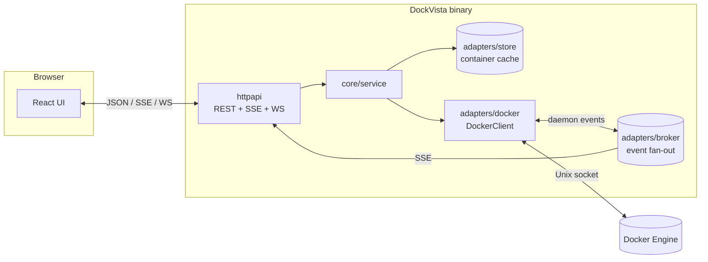

# DockVista

[](https://github.com/faritreascodev/dockvista/actions/workflows/ci.yml)

[](LICENSE)

A self-contained Docker dashboard — Containers, Images, Volumes, Networks and
Compose-project grouping, a live terminal into any container, real-time
updates pushed from the Docker daemon's own event stream, and a
Portainer-style login wall — built with a clean-architecture Go backend and
a React/TypeScript frontend, shipped as a single binary.

## Features

- **Full container lifecycle** — create, start, stop, pause, restart, remove,
  live logs (SSE), an interactive `/bin/sh` terminal (WebSocket), and a raw
  Inspect view.
- **Images, Volumes, Networks** — list, create/pull, remove, and prune, each
  with the same validation and confirmation-before-delete pattern.
- **Compose grouping** — containers grouped by their
  `com.docker.compose.project` label, with per-service actions. Read-only
  grouping, not full `docker compose up/down` orchestration — see
  [Roadmap](#roadmap) for why.
- **Real-time, not polling** — a background goroutine subscribes to the
  Docker daemon's own event stream and fans it out over SSE; the UI refetches
  within about a second of a real change (`docker stop` from another
  terminal, a health check flipping, etc.) instead of waiting on a timer.
  Interval polling only exists as a safety net in case an event is missed.
- **Real CPU% / memory metrics** — computed with the same delta formula
  `docker stats` uses, via the Docker SDK's one-shot stats API.
- **Login required** — first launch walks you through creating a single
  admin account; every `/api/*` route is behind that session except the
  bootstrap endpoints themselves. See [Security](#security) below.
- **Light / dark theme + accent color** — persisted per browser, no rebuild
  needed to switch.
- **One binary** — the built frontend is embedded into the Go binary via
  `go:embed`; `go build` alone produces a deployable artifact.

## Architecture

DockVista follows the standard Go project layout with a clean-architecture
split between the core domain and its adapters:

```
cmd/dockvista/            entry point: config, DI, event bridge, graceful shutdown
internal/core/
  domain/                 framework-free types (Container, Image, Volume, Network, Event, User, ...)
  ports/                  interfaces the core depends on (DockerClient, ImageClient, CredentialStore, ...)
  service/                use cases: containers, images, volumes, networks, auth
internal/adapters/
  docker/                 implements the ports.*Client interfaces against the Docker SDK
  store/                  in-memory, mutex-guarded container cache
  authstore/              file-backed admin credentials + session signing key
  broker/                 in-process pub/sub fanning daemon events out to SSE subscribers
  httpapi/                REST + SSE + WebSocket handlers, validation, auth middleware
internal/platform/embedweb/  embeds web/dist into the binary
pkg/httpjson/              tiny, dependency-free JSON response helpers
web/                        React + TypeScript (Vite) frontend
```



The core (`internal/core`) never imports the Docker SDK or `net/http` — it
only knows about small `ports.*Client` interfaces, which `internal/adapters/*`
implement. This is what makes the service layer testable with fakes (see
`internal/core/service/*_test.go`) instead of a running Docker daemon.

## Quickstart

**Prerequisites:** Go 1.25+, Node 20+, and access to a Docker daemon (local
socket or `DOCKER_HOST`). No native/WebKit dependencies — this ships as a
browser-based web app, not a desktop shell.

```bash
git clone https://github.com/faritreascodev/dockvista.git
cd dockvista
make dev      # API on :8080, Vite dev server with hot reload proxying /api
```

Or build the single production binary:

```bash
make build              # builds web/, embeds it, compiles ./bin/dockvista
./bin/dockvista          # serves the full app on :8080
```

Or with Docker:

```bash
make docker-build
docker run -p 8080:8080 \
  --group-add "$(stat -c '%g' /var/run/docker.sock)" \
  -v /var/run/docker.sock:/var/run/docker.sock:ro \
  -v dockvista-data:/data dockvista:local
```

**First launch:** open the app in your browser — there's no default account.
You'll land on a "Create admin account" screen; whatever username/password
you set there becomes the only login for that instance. See
[Security](#security) for what that does and doesn't mean.

### Configuration

All configuration is environment-based (see `internal/config/config.go`):

| Variable                     | Default | Description                                              |
| ----------------------------- | ------- | --------------------------------------------------------- |
| `DOCKVISTA_ADDR`               | `:8080` | HTTP listen address                                        |
| `DOCKVISTA_POLL_INTERVAL`      | `30s`   | Background container-list refresh — a safety net; the event stream drives the real-time updates |
| `DOCKVISTA_SHUTDOWN_TIMEOUT`   | `10s`   | Graceful shutdown drain timeout                            |
| `DOCKVISTA_DATA_DIR`           | `./data`| Where the admin account and session signing key are stored |

## Security

- **No default credentials, anywhere.** The admin account is created
  interactively on first launch (`POST /api/auth/setup`, only reachable once)
  and stored bcrypt-hashed in `<DOCKVISTA_DATA_DIR>/credentials.json`
  (`0600`, never committed — `data/` is gitignored). Every install gets its
  own account.
- **Single-user, by design — this is not a multi-tenant tool.** There is one
  admin account per running instance, no roles, no per-user permissions.
  It's built for "each person runs their own instance against their own
  Docker daemon." If you need several people to share one running instance
  with individually attributable logins, that's not supported yet — treat
  the current model as one shared login for that case, or run separate
  instances instead.
  Sessions are stateless, HMAC-signed cookies (`SameSite=Strict`,
  `HttpOnly`), so login survives a restart as long as `DOCKVISTA_DATA_DIR`
  persists (the Docker run example above mounts a named volume for exactly
  this reason).
- **No CORS, on purpose.** The API and the built frontend are always served
  from the same origin (in dev, Vite's proxy makes it so too), so there's no
  legitimate cross-origin caller and nothing to allow-list.
- **The login wall gates access to the daemon, not actions within it.**
  Once authenticated, there's no sandboxing on what a container can be
  created with (bind mounts, environment, etc.) or which container the
  terminal can exec into. This mirrors Portainer and Docker Desktop's own
  trust model: anyone who can reach the Docker socket already has
  host-root-equivalent control, so restricting what DockVista's own forms
  allow wouldn't add real security — only the login wall does.
- Rate limiting, strict input validation (container/image/volume/network
  identifiers, ports, restart policies), and a security audit trail are in
  `internal/adapters/httpapi/ratelimit.go` and `validate.go` if you want the
  specifics.

## Development

```bash
make test    # go test ./... -race -cover
make lint    # golangci-lint + eslint
make tidy    # go mod tidy + npm install
```

## Roadmap

Implemented:

- [x] Containers — full CRUD, live logs, interactive terminal, Inspect
- [x] Images, Volumes, Networks — list/create/pull/remove/prune
- [x] Compose — read-only grouping by project label
- [x] Real-time updates via the Docker event stream
- [x] Login / session auth

Intentionally not implemented — these need either a fundamentally different
deployment model or scope this project doesn't take on:

- [ ] Full `docker compose up/down` orchestration — would need host
      filesystem access to compose files and the `compose` CLI plugin
      bundled into the (currently distroless, shell-less) runtime image, a
      different trust and deployment model than "just needs the socket."
- [ ] Multi-user accounts / roles — see [Security](#security); the current
      model is one admin per instance.
- [ ] Shell auto-detection for the terminal (`/bin/bash` → `/bin/sh` →
      fallback) — it always tries `/bin/sh`; a `FROM scratch` image with no
      shell surfaces as a clear error instead.

## Contributing

See [CONTRIBUTING.md](CONTRIBUTING.md).

## License

[MIT](LICENSE)
